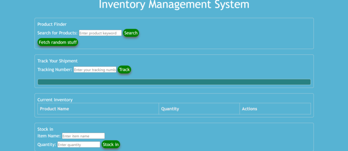

#HackersAnonymous
## Project-1

README Template
# <Your-Project-Title>

## Description
We wanted to develop a site that conducted searches for produects and that had the ability to restock products at a certain point. The motivation came out of a desire to make businesses more efficient at keeping track of their inventory. 
Challenges were by far the most prevalent in JavaScript. We faced challenges with API ideas and with API usage. 

## Technologies Used 

Bulma IO
Rapid API

## Usage
Screenshot: 

https://files.slack.com/files-pri/T072HFC5LAD-F07NM678FPX/screenshot_2024-09-23_204708.png 

## License
MIT

